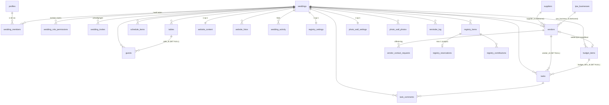

# Functioneel & Technisch Ontwerpdocument (FDD/TDD)

## Wedding Planner — alles-in-één bruiloftsplanner

| | |
|---|---|
| **Product** | Wedding Planner (`wedding-planner`) |
| **Documenttype** | Gecombineerd Functioneel Ontwerp (FDD) en Technisch Ontwerp (TDD) |
| **Scope** | De huidige, geïmplementeerde staat van de applicatie ("as-is") |
| **Doelgroep document** | Ontwikkelaars, architecten en productverantwoordelijken |
| **Taal applicatie** | Nederlands (UI, datamodel-terminologie en e-mails) |

---

# 1. Executive Summary & User Journey

## 1.1 Wat de applicatie is

Wedding Planner is een webapplicatie waarmee bruidsparen hun bruiloft van A tot Z plannen en organiseren, samen met de mensen die hen helpen (partner, ceremoniemeester, getuigen). De applicatie combineert negen samenhangende planningsmodules — taken, budget, gasten & RSVP, leveranciers, tafelschikking, draaiboek, trouwwebsite, cadeaulijst en fotomuur — rondom één centrale entiteit: de **bruiloft** (`wedding`). Een AI-laag (Google Gemini) levert per module contextueel advies op basis van de werkelijke planningsdata van het bruidspaar.

Kernkarakteristieken van het systeem:

- **Multi-tenant**: elke bruiloft is een afgeschermde tenant; alle deelentiteiten dragen een `wedding_id`. Eén gebruiker kan lid zijn van meerdere bruiloften en daartussen wisselen.
- **Samen plannen**: leden hebben rollen (`owner`, `planner`, `helper`, `viewer`) met een per bruiloft instelbare rechten-matrix per module; alle data synchroniseert live via Supabase Realtime; een activiteitenfeed en opmerkingen op taken maken wijzigingen van anderen zichtbaar.
- **Twee gezichten**: een ingelogde planningsomgeving (`/bruiloft/...`) voor het bruidspaar en zijn helpers, en publieke, token- of slug-gebaseerde pagina's voor gasten (trouwwebsite, RSVP, cadeaulijst, fotomuur) die géén account vereisen.
- **Server-autoritatieve beveiliging**: Postgres Row Level Security (RLS) is de autoritatieve grens; de client-permissielogica stuurt uitsluitend de UI. Publieke toegang loopt uitsluitend via `SECURITY DEFINER` RPC's die whitelisted velden teruggeven.

## 1.2 Doelgroepen

| Doelgroep | Toegang | Wat ze doen |
|---|---|---|
| **Bruidspaar** (owner) | Ingelogd, volledige rechten | Bruiloft aanmaken, alle modules beheren, leden en rechten beheren |
| **Mede-planners** (planner/helper/viewer) | Ingelogd, rechten per module | Meehelpen binnen de modules waarvoor de owner rechten heeft gegeven |
| **Gasten** | Publiek, via token of slug | Trouwwebsite bekijken, RSVP indienen, cadeau reserveren/bijdragen, foto's uploaden |
| **Platformbeheerder** (`platform_admin`) | Ingelogd, read-only op tenants | Monitoring, gebruikersstatistieken, foutlogs, AI-gebruik |

## 1.3 Overkoepelende user journey

De journey volgt de chronologie van een bruiloft:

```
 Registratie ──► Trouwplan-setup ──► Plannen (maandenlang) ──► Trouwdag ──► Na afloop
 (account +      (wizard: namen,     dashboard, taken, budget,  (draaiboek,   (fotomuur
  e-mailbe-       datum, budget,     leveranciers, gasten,       fotomuur      bekijken,
  vestiging)      gastaantallen,     RSVP, tafels, website,      live)         cadeau-
                  voortgang)         cadeaulijst, AI-coach)                    bijdragen
                                                                               bevestigen)
```

1. **Registratie & login** — De gebruiker maakt een account aan (`/signup`, `/aanmelden`) met e-mail/wachtwoord, bevestigt het e-mailadres (`/bevestig-email`, `/auth/confirm`) en logt in (`/inloggen`). Wachtwoord-vergeten en -reset zijn aanwezige flows.
2. **Trouwplan-setup** — Bij het eerste bezoek aan `/bruiloft` doorloopt de gebruiker een setup waarin de kerngegevens van de bruiloft worden vastgelegd: partnernamen, trouwdatum, (eventuele) locatie, woonplaats/provincie, totaalbudget, geschatte dag- en avondgastaantallen, ceremonietype en welke grote zaken al geregeld zijn (`geregeldeZaken`). Optioneel worden een sjabloon-takenlijst en sjabloon-budgetregels gegenereerd, afgestemd op de trouwdatum.
3. **Uitnodigen van mede-planners** — De owner nodigt partner en helpers per e-mail uit (`/bruiloft/beheer/leden`); de genodigde accepteert via een tokenlink (`/uitnodiging/[token]`) en krijgt de rol en rechten die de owner heeft ingesteld.
4. **Plannen** — Het dashboard (`/bruiloft`) toont de voortgang; de AI Wedding Planner geeft per module een status en concrete acties. De gebruiker werkt in de modules: taken afvinken, budget bijhouden, leveranciers zoeken/boeken (inclusief een doorzoekbare landelijke leveranciersdirectory onder `/bruiloft/ontdekken`), gasten beheren en RSVP-uitnodigingen versturen, tafels indelen, het draaiboek van de trouwdag opbouwen, de trouwwebsite samenstellen en publiceren, en de cadeaulijst inrichten.
5. **Gasteninteractie** — Gasten ontvangen een persoonlijke RSVP-link (e-mail of WhatsApp), bekijken de trouwwebsite (`/trouwen/[slug]`), bevestigen of melden af, geven dieetwensen en gezelschapsgrootte door, reserveren cadeaus of dragen bij aan fondsen (`/trouwen/[slug]/cadeaulijst`).
6. **Trouwdag** — Het draaiboek stuurt de dag; de live fotomuur (`/foto/[slug]`) laat gasten foto's uploaden die real-time op een groot scherm (`/foto/[slug]/scherm`) en op telefoons verschijnen.
7. **Doorlopend** — Een dagelijkse cron stuurt e-mailherinneringen voor naderende taakdeadlines en betaaltermijnen; de activiteitenfeed (`/bruiloft/activiteit`) toont wie wat wijzigde.

---

# 2. Systeem Architectuur & Datamodel

## 2.1 Technologie-stack

| Laag | Technologie | Rol |
|---|---|---|
| Frontend framework | **Next.js 14** (App Router) + **React 18** | Pagina's, route handlers, server/client components |
| Styling | **Tailwind CSS** (+ design-tokens, `tailwindcss-animate`, Radix UI-primitieven, `lucide-react`) | UI conform `DESIGN_PHILOSOPHY.md` |
| Client-state | **Zustand** (`store/bruiloftStore.ts`, één store) | Alle appdata + UI-state; optimistische updates |
| Backend-as-a-Service | **Supabase** | Postgres, Auth, Row Level Security, Realtime, Storage |
| Sessies | `@supabase/ssr` | Cookie-gebaseerde sessies, ververst in Next.js middleware |
| AI | **Google Gemini** (`@google/generative-ai`) | Advies-, generatie- en rangschikkingsendpoints |
| E-mail | **Resend** | RSVP-uitnodigingen, ledeninvites, herinneringen, cadeaulijst-mails |
| Validatie | **zod** | Schema-validatie van API-request-bodies |
| Observability | **Sentry** (`@sentry/nextjs`) + eigen `error_logs`/`analytics_events` | Fout- en gebruiksmonitoring |
| Overig | `@dnd-kit` (drag & drop tafels), `recharts` (grafieken), `xlsx`/`mammoth` (bestandsimport gasten), `qrcode` (fotomuur-QR) | |
| Hosting | **Vercel** (`vercel.json`, dagelijkse cron op `/api/cron/reminders`) | |

Er is geen geautomatiseerde testsuite; verificatie loopt via `tsc --noEmit`, `next lint` en handmatige/Playwright-controle.

## 2.2 Architectuuroverzicht

```
┌────────────────────────────  Browser  ────────────────────────────┐
│  Ingelogde app (/bruiloft/*)          Publieke pagina's           │
│  React-pagina's ──► Zustand-store     /trouwen/[slug]             │
│        │  optimistisch muteren        /rsvp/[token]               │
│        ▼                              /uitnodiging/[token]        │
│  supabaseRepository (mappers          /foto/[slug](/scherm)       │
│  camelCase ◄─► snake_case)            /trouwen/[slug]/cadeaulijst │
└──────┬──────────────▲─────────────────────────┬──────────────────┘
       │ CRUD (RLS)   │ Realtime-events         │ SECURITY DEFINER RPC's
       ▼              │                         ▼ (anon, whitelisted output)
┌──────────────────────────  Supabase  ─────────────────────────────┐
│  Postgres (RLS op elke tabel, triggers, RPC's)                    │
│  Auth (e-mail/wachtwoord, e-mailbevestiging)                      │
│  Realtime (publication op alle module-tabellen)                   │
│  Storage (bucket wedding-media, fotomuur-uploads)                 │
└──────────────▲────────────────────────────────▲──────────────────┘
               │ service-role / anon+RPC        │ service-role
┌──────────────┴──────────────┐   ┌─────────────┴───────────────────┐
│  Next.js route handlers     │   │  Vercel Cron (dagelijks)        │
│  /api/ai/*      → Gemini    │   │  /api/cron/reminders            │
│  /api/registry/*→ RPC+mail  │   │  → reminder-digest per gebruiker│
│  /api/email/*   → Resend    │   └─────────────────────────────────┘
│  /api/foto/upload, /api/... │
└─────────────────────────────┘
```

Architectuurprincipes zoals geïmplementeerd:

1. **Eén store, één repository.** Alle pagina's lezen uit `store/bruiloftStore.ts`; mutaties lopen via `lib/bruiloft/supabaseRepository.ts`, dat rijen vertaalt tussen database (`snake_case`) en domeintypes (`camelCase`, `lib/bruiloft/mappers.ts`).
2. **Afgeleide waarden worden bij het lezen berekend** (`lib/bruiloft/derived.ts`) en nooit teruggeschreven — geen denormalisatie, geen update-loops.
3. **RLS is de autoritatieve autorisatielaag.** `lib/bruiloft/permissions.ts` spiegelt dezelfde matrix client-side, maar uitsluitend om de UI te sturen.
4. **Publiek verkeer raakt nooit tabellen direct.** `anon` heeft geen tabel-grants; alles loopt via `SECURITY DEFINER` RPC's die per functie expliciet aan `anon` ge-grant zijn en uitsluitend gewhiteliste velden teruggeven.
5. **Server-autoritatieve invulling** van gevoelige velden: auteursnaam bij opmerkingen, actor bij activiteitenfeed, rate-limit-tellers — via triggers en definer-functies, niet via client-input.

## 2.3 Datamodel (entiteiten en relaties)

### 2.3.1 ER-overzicht



### 2.3.2 Tabellen per domein

**Identiteit & tenancy**

| Tabel | Sleutelvelden | Doel |
|---|---|---|
| `profiles` | `id` (= `auth.users.id`), `email`, `display_name`, `app_role` (`member`/`platform_admin`), `email_herinneringen`, `last_seen`, avatar | Eén profiel per auth-gebruiker; automatisch aangemaakt via trigger `handle_new_user` bij registratie |
| `weddings` | `id`, `partner1_naam`, `partner2_naam`, `trouwdatum`, `locatie`, `woonplaats`, `provincie`, `totaal_budget numeric(12,2)`, `aantal_daggasten`, `aantal_avondgasten`, `ceremonietype`, `geregelde_zaken jsonb`, `taken_voorstellen jsonb`, `budget_categorieen jsonb`, `created_by` | De tenant-root; alle deelentiteiten verwijzen hiernaar met `on delete cascade` |
| `wedding_members` | PK (`wedding_id`,`user_id`), `role` ∈ owner/planner/helper/viewer | Lidmaatschap + rol. Trigger `prevent_last_owner_removal` garandeert minstens één owner |
| `wedding_role_permissions` | PK (`wedding_id`,`role`,`module`), `level` ∈ none/view/edit | De per bruiloft aanpasbare rechten-matrix voor planner/helper/viewer (owner staat er niet in: altijd `edit`). Ge-seed door trigger `add_creator_as_owner` |
| `wedding_invites` | `token` (16 random bytes hex, uniek), `email`, `role`, `expires_at` (14 dagen), `accepted_at` | Uitnodigingen voor mede-planners; alleen owner ziet/beheert ze |

**Planningsmodules** (allemaal `wedding_id`-gescoped, `updated_at`-trigger, realtime-gepubliceerd)

| Tabel | Belangrijkste velden | Bijzonderheden |
|---|---|---|
| `tasks` | `titel`, `omschrijving`, `deadline date`, `tijdsblok` (8 vaste labels), `status` ∈ open/bezig/klaar, `prioriteit` ∈ laag/midden/hoog, `toegewezen_aan` (legacy tekst-enum), `assignees` (array van member-user-ids), `subtaken jsonb`, `volgorde`, `vendor_id`, `budget_item_id` | `tijdsblok` wordt client-side afgeleid uit deadline t.o.v. trouwdatum (`deriveTijdsblok`); subtaken één niveau diep als jsonb-array |
| `budget_items` | `categorie` (vrije tekst; lijst beheerd in `weddings.budget_categorieen`), `omschrijving`, `geschat_bedrag`, `geoffreerd_bedrag`, `betaald_bedrag` (alle `numeric(12,2)`, euro's), `vendor_id`, `betaaltermijnen jsonb` | Betaaltermijnen als jsonb-array `{id, bedrag, vervaldatum, betaald}` |
| `guests` | `voornaam`, `achternaam`, `categorie` (vrije tekst), `gasttype` (vrije tekst, default `daggast`), `rsvp_status` (5 vaste statussen), `dieetwensen`, `heeft_partner`, `partner_naam`, `aantal_kinderen`, `adres`, `notitie`, `email`, `telefoon`, `tafel_id`, `stoel_index`, `rsvp_token` (uniek, 16 bytes hex), `rsvp_submitted_at`, `rsvp_token_revoked` | `rsvp_token` is de persoonlijke publieke sleutel van de gast; intrekbaar |
| `vendors` | `naam`, `type` (vrije tekst sinds migratie 0036), `status` (5 pipeline-stappen), contactvelden, `geoffreerd_bedrag`, `notitie`, `budget_item_id`, `supplier_id`, `tpw_business_id` | `supplier_id`/`tpw_business_id` = herkomst uit de directory; leeg bij handmatige invoer |
| `vendor_contact_requests` | `vendor_id`, `type` ∈ offerte/contact, `onderwerp`, `bericht`, `verzonden_naar`, `verzonden_door` | Append-only log van verzonden offerte-/contactmails, los van `vendors.status` |
| `schedule_items` | `tijd 'HH:MM'`, `eindtijd`, `titel`, `omschrijving`, `locatie`, `betrokkenen jsonb` (rollenlijst) | Draaiboek van de trouwdag |
| `tables` | `naam`, `vorm` ∈ rond/vierkant/langwerpig, `capaciteit`, `pos_x`, `pos_y`, `rotatie` | Positievelden voor de vrije plattegrond (wereldeenheden, rotatie in 45°-stappen) |
| `website_content` | 1-op-1 met wedding (`unique wedding_id`); tekstsecties, `slug` (uniek), `website_gepubliceerd`, `thema` (6 thema's), `kleur_accent`, `kop_lettertype` (6 fonts), `header_foto_url`, `header_overlay`, `secties_config jsonb`, `faq jsonb`, `gallerij jsonb` | Upsert-patroon |
| `website_fotos` | `url`, `bijschrift`, `volgorde` | Galerijfoto's, opgeslagen in Storage-bucket `wedding-media` |

**Samenwerking**

| Tabel | Doel |
|---|---|
| `wedding_activity` | Activiteitenfeed. Alléén geschreven door `SECURITY DEFINER`-trigger `log_activity` (AFTER insert/update/delete op de zes moduletabellen). Bevat `module` (mapt op rechten-matrix), `entity_type`, `action`, `actor_id`, `actor_name` (snapshot), `label` (best-effort titel van de rij). Select-policy: `can_view(wedding_id, module)` — de feed erft dus exact de moduletoegang (geen budget-lek naar een helper) |
| `task_comments` | Opmerkingen op taken. Trigger `task_comments_prepare` vult server-side `author_id`/`author_name` in en valideert dat de taak bij dezelfde bruiloft hoort. Verwijderen mag de auteur zelf of de owner; geen update in v1 |

**Cadeaulijst (registry)** — bedragen in **centen** (integers)

| Tabel | Doel |
|---|---|
| `registry_settings` | 1-op-1 met wedding: `is_enabled`, optioneel `password`, `intro_text`, `bank_account_iban`/`_name`, eigen `thema`/`kleur_accent`/`kop_lettertype` |
| `registry_items` | `type` ∈ `gift` (reserveerbaar cadeau) / `fund` (geldpot), `title`, `description`, `image_url`, `shop_url`, `target_amount` (centen, alleen fund), `suggested_amounts int[]`, `payment_link`, `sort_order`, `is_visible` |
| `registry_reservations` | Max. één per item (`unique(item_id)`); `cancel_token uuid` voor annuleren door de gast; naam/e-mail/bericht van de gast |
| `registry_contributions` | Bijdragen aan funds: `amount` (centen), `payment_status` ∈ pending/confirmed/cancelled, `payment_method` ∈ bank_transfer/payment_link, `payment_reference`, `confirmed_at` |

**Fotomuur**

| Tabel | Doel |
|---|---|
| `photo_wall_settings` | 1-op-1 met wedding: `is_active`, `title`, `moderation_required`, `require_name`, `guests_can_download`, kolommenaantal |
| `photo_wall_photos` | `storage_path`, `url`, `guest_name`, `message`, `is_approved`, `is_featured`. Anon mag goedgekeurde foto's lezen (nodig voor realtime); insert loopt uitsluitend via de API-route |

**Directory (gedeelde catalogus, niet tenant-gebonden)**

| Tabel | Doel |
|---|---|
| `suppliers` | Landelijke leveranciersdirectory (locaties, fotografen, catering, …): categorie, subtype, adres/geo (lat/long, provincie), capaciteit, prijsindicatie, contact/media, `tags`, `ai_context_tekst`, Nederlandstalige full-text `search_vector` (GIN) + trigram-index op naam. Idempotente import via `scripts/import-suppliers.mjs` op `unique(bron, external_id)` |
| `tpw_businesses` | Tweede directorybron met integer `tpw_id` als sleutel; doorzoekbaar via `/api/tpw-businesses/search` |

**Systeem & platform**

| Tabel | Doel |
|---|---|
| `reminder_log` | Idempotentie van herinneringsmails: `unique(soort, ref_id, mijlpaal, user_id)`. RLS aan zónder policies: alleen de service-role (cron) leest/schrijft |
| `rate_limits` | Persistente rate-limiting over serverless-instanties heen; atomische teller via definer-RPC `increment_rate_limit(key, max, window)` |
| `ai_wedding_planner_cache`, `ai_advice_cache`, `ai_taken_cache`, `ai_budget_cache`, `ai_draaiboek_cache`, `ai_supplier_rank_cache` | Per bruiloft gecachte AI-output (`jsonb`) + `last_updated_at`; RLS op lidmaatschap |
| `error_logs`, `analytics_events` | Eigen monitoring; insert door ingelogde clients (eigen `user_id`), select alleen `platform_admin` |

### 2.3.3 Integriteitsregels op databaseniveau

- **Cascade bij tenant-verwijdering**: alle kindtabellen `on delete cascade` op `wedding_id`.
- **Ontkoppelen i.p.v. meeverwijderen**: kruisverwijzingen (`guests.tafel_id`, `tasks.vendor_id`, `tasks.budget_item_id`, `vendors.budget_item_id`, `budget_items.vendor_id`) zijn `on delete set null`.
- **Kruis-tenant-guards**: BEFORE-triggers (`guests_check_refs`, `tasks_check_refs`, `vendors_check_refs`, `budget_items_check_refs`) verwerpen koppelingen naar rijen van een ándere bruiloft — RLS dekt dit niet automatisch.
- **Owner-garantie**: `prevent_last_owner_removal` blokkeert het degraderen/verwijderen van de laatste owner (behalve bij cascade van de bruiloft zelf).
- **`updated_at`**: centrale triggerfunctie `set_updated_at()` op elke tabel met dat veld.

## 2.4 Rollen- en rechtenmodel

Twee lagen:

1. **Platformlaag** (`profiles.app_role`): `member` (standaard) of `platform_admin`. Een platform_admin kan via RLS-helpers overal **lezen** (support/monitoring) maar bewust **niet schrijven** (`can_edit` checkt geen admin).
2. **Bruiloftlaag** (`wedding_members.role` + `wedding_role_permissions`): per module een niveau `none`/`view`/`edit`.

Standaardmatrix, ge-seed bij het aanmaken van een bruiloft (owner altijd `edit` op alles):

| Module | planner | helper | viewer |
|---|---|---|---|
| dashboard | view | view | view |
| taken | edit | edit | view |
| draaiboek | edit | view | view |
| tafels | edit | none | view |
| gasten | view | none | none |
| leveranciers | view | none | none |
| budget | none | none | none |
| website | none | none | none |
| beheer | none | none | none |

De owner kan deze matrix per bruiloft bijstellen (`/bruiloft/beheer/leden`). De client kent daarnaast een `registry`-module (cadeaulijst) in `lib/bruiloft/permissions.ts`; de bijbehorende RLS-policies gebruiken `can_edit(wedding_id, 'registry')`.

RLS-helperfuncties (alle `SECURITY DEFINER`, `STABLE`): `is_platform_admin()`, `is_wedding_member(wedding)`, `member_role(wedding)`, `module_level(wedding, module)`, `can_view(wedding, module)`, `can_edit(wedding, module)`. Elke moduletabel heeft vier policies volgens het vaste patroon: `select` op `can_view`, `insert/update/delete` op `can_edit` (met `with check` die het verzetten van `wedding_id` blokkeert).

---

# 3. Module Documentatie

Elke module hieronder wordt beschreven vanuit (a) het functionele perspectief — user flow en interactie — en (b) het technische perspectief — datamodel, API/RPC en logica. Paginacode staat in `app/bruiloft/<module>/page.tsx`, UI-componenten in `components/bruiloft/<module>/`, gedeelde bouwstenen in `components/bruiloft/ui/`.

## 3.1 Onboarding & Trouwplan-setup

### Functioneel

- **Registreren**: `/signup` en `/aanmelden` (aanmeldvarianten); gebruiker vult e-mail, wachtwoord en weergavenaam in. Na registratie volgt e-mailbevestiging (`/bevestig-email` als wachtscherm; `/auth/confirm` verwerkt de bevestigingslink).
- **Inloggen**: `/inloggen` (en `/login`); `/wachtwoord-vergeten` en `/wachtwoord-resetten` voor herstel; `/auth/reset` en `/auth/callback` verwerken de auth-redirects.
- **Eerste bruiloft**: bij binnenkomst op `/bruiloft` zonder bestaande bruiloft toont de app een setup-flow. De gebruiker vult de kerngegevens van §1.3 stap 2 in en kiest of er een sjabloon-takenlijst en sjabloon-budgetregels aangemaakt worden.
- **Meerdere bruiloften**: heeft de gebruiker meerdere lidmaatschappen, dan verschijnt een keuzescherm (`pickingWedding` in de store); vanuit het accountmenu kan een extra trouwplan gestart worden (`creatingWedding`). De actieve keuze wordt onthouden.
- **"Onze gegevens"-modal**: de kern-bruiloftgegevens zijn app-breed te bewerken via een modal (`weddingSettingsOpen`), te openen vanuit hero, profielkaart, accountmenu en profiel-nudge.
- **Account**: `/bruiloft/account` voor profiel (naam, avatar, e-mailherinneringen aan/uit); accountverwijdering via `/account/verwijderen`.

### Technisch

- **Datamodel**: `auth.users` (Supabase Auth) → trigger `handle_new_user` maakt `profiles`-rij (display_name uit metadata of e-mail-prefix). `weddings.created_by` default `auth.uid()`.
- **Bruiloft aanmaken**: platte `insert` op `weddings`; AFTER-trigger `add_creator_as_owner` voegt de maker als `owner` toe en seedt de rechten-matrix. De select-policy op `weddings` accepteert óók `created_by = auth.uid()` zodat `INSERT ... RETURNING` werkt vóórdat het lidmaatschap zichtbaar is.
- **Sjabloongeneratie**: `lib/bruiloft/templateTasks.ts` en `templateBudgetItems.ts` genereren taken/budgetregels client-side; deadlines worden teruggerekend vanaf de trouwdatum met `lib/bruiloft/timeblocks.ts` (`deriveTijdsblok`, `addMonths`, `addDays`). Het tijdsblok-label kent acht vaste waarden van '12 maanden voor' t/m 'na de bruiloft'.
- **Sessies**: `middleware.ts` draait `updateSession` (`@supabase/ssr`) op alle routes behalve statics: auth-cookies worden bij elk request ververst.
- **Store-init**: `bruiloftStore.init()` laadt gebruiker, lidmaatschappen, actieve bruiloft en alle moduledata via `supabaseRepository`, bepaalt `role` + `permissions` (owner ⇒ `ALL_EDIT_PERMISSIONS`) en start realtime.

## 3.2 Dashboard & AI Wedding Planner

### Functioneel

- **Dashboard** (`/bruiloft`): hero met partnernamen en aftelling naar de trouwdatum, voortgangsoverzicht per module (taak-, gast-, budgettellingen, eerstvolgende taken en betaaltermijnen), toegang tot de "Onze gegevens"-modal en nudges (profiel compleet maken, AI-moment).
- **AI-coach-paneel**: app-breed te openen (topbalk, nudges; `aiCoachOpen` in de store, paneel in `WeddingShell`).
- **AI Wedding Planner** (`/bruiloft/ai-wedding-planner`): genereert een integraal advies: een globale status (`op_schema`/`actie_vereist`/`kritiek` + samenvatting + score) en per module (taken, budget, leveranciers, draaiboek, gasten, website) een status, globaal advies en concrete acties met deeplinks naar de betreffende module.

### Technisch

- **Endpoint**: `POST /api/ai/wedding-planner` (Node runtime, `force-dynamic`). Flow: sessie valideren → rate-limit-check (`checkRateLimit` → RPC `increment_rate_limit`) → alle moduledata van de bruiloft laden → `buildAIContext()` → cache-check → zo nodig Gemini aanroepen met `buildConsolidatedPrompt` → antwoord parsen (`parseConsolidated`) → cache-write (`ai_wedding_planner_cache`) → `logAiUsage`.
- **AI-context** (`lib/bruiloft/aiContext.ts`): één gestructureerd `AIWeddingContext`-object met bruidspaar (incl. dagen tot bruiloft, geregelde zaken), budgettotalen + richtbedragen per categorie, taakstatistieken + urgente taken, leveranciersstatus per type, gasttellingen, draaiboek- en websitestatus, aankomende betalingen, en server-side verrijking: samenvatting van het regionale leveranciersaanbod (`bouwLeveranciersAanbod`) en een **deterministische urgentie per onderwerp** (`lib/bruiloft/ai/urgentie.ts` + `onderwerpBenchmarks.ts` — Nederlandse benchmark-doorlooptijden per onderwerp), die als feit aan het model wordt meegegeven.
- **Cache-invalidatie via fingerprint**: `buildAIFingerprint()` combineert trouwdatum, een tijd-bucket (dagelijks vers in de laatste maand, wekelijks bij 1–6 maanden, maandelijks daarvoor), taak-/budget-/gast-/boekingstellers, voortgangs-hash en urgentiefase-hash. Wijzigt de fingerprint niet, dan wordt de gecachte `jsonb` teruggegeven zonder modelaanroep. Aanvullend geldt een minimuminterval (rate-limiting op `last_updated_at`).
- **Prewarm**: `POST /api/ai/prewarm` + `profiles.ai_prewarmed_on` genereren advies op de achtergrond zodat het paneel direct gevuld opent.

## 3.3 Takenlijst (`/bruiloft/taken`)

### Functioneel

- Taken staan gegroepeerd per **tijdsblok** (aftellend naar de trouwdag). Per taak: titel, omschrijving, deadline, prioriteit, status (open → bezig → klaar), toegewezen leden (avatars), subtaken met afvinklijst, koppeling aan een leverancier en/of budgetregel, en opmerkingen (commentsdraad).
- **Kaart-voor-kaart voorstellen**: sjabloontaken die nog niet in de lijst staan worden één voor één voorgesteld; per kaart kiest de gebruiker "toevoegen" of "overslaan". De beslissingen zijn gedeeld per bruiloft zodat partners elkaars keuzes zien.
- **AI-taaksuggesties**: op verzoek genereert de AI extra taken passend bij de situatie; de gebruiker voegt ze per stuk of in bulk toe.
- **Bulk-acties**: meerdere taken tegelijk bijwerken (status, prioriteit, assignee, deadline verschuiven met N dagen) of verwijderen.
- Handmatige sortering binnen een tijdsblok is mogelijk (volgorde-veld).

### Technisch

- **Datamodel**: `tasks` (zie §2.3.2). `assignees` is een array van `wedding_members.user_id`s; het legacy-veld `toegewezen_aan` blijft als fallback voor oude taken. `subtaken` is een jsonb-array `{id, titel, klaar}` (één niveau diep).
- **Tijdsblok-afleiding**: bij aanmaken/bijwerken berekent de store `tijdsblok` uit `deadline` en `wedding.trouwdatum` (`deriveTijdsblok`); de database bewaart het resultaat als tekst met CHECK-constraint.
- **Voorstellen-state**: `weddings.taken_voorstellen` (`{beslist: {taaktitel: 'toegevoegd'|'overgeslagen'}, afgerond}`) — gedeeld, dus beide partners zien dezelfde reststapel.
- **Opmerkingen**: `task_comments`; insert vereist `can_edit('taken')`, de BEFORE-trigger vult auteur in; realtime-gepubliceerd zodat draadjes live bijwerken.
- **AI-endpoint**: `POST /api/ai/taken` met cache in `ai_taken_cache`; bulktoevoeging via store-actie `addAITaken`. `addTemplateMissing(titels)` voegt ontbrekende sjabloontaken toe.
- **Ledenlijst voor de assignee-picker**: RPC `list_wedding_members(wedding)` (definer; leden mogen elkaars profiel niet direct lezen) levert `userId/email/displayName/role`-snapshots.
- **Herinneringen**: taken met deadline voeden de dagelijkse reminder-cron (mijlpalen `7d`, `1d`, `te-laat`; zie §3.13).

## 3.4 Budget (`/bruiloft/budget`)

### Functioneel

- De gebruiker legt een **totaalbudget** vast (in de bruiloftgegevens) en werkt met budgetregels per **categorie** (zelf te beheren lijst, vrije tekst; standaardset van 11 categorieën als vertrekpunt). Per regel: omschrijving, geschat bedrag, geoffreerd bedrag, betaald bedrag, koppeling aan een leverancier en **betaaltermijnen** (bedrag + vervaldatum + betaald-vinkje).
- **Slim budget**: een richtverdeling verdeelt het totaalbudget over de standaardcategorieën volgens vaste Nederlandse praktijkpercentages; per categorie is zichtbaar of er al een regel bestaat. Afwijkingen worden gemarkeerd: regels waar geoffreerd/betaald boven de schatting uitkomt, en een totaalsignaal wanneer het geoffreerde totaal het budget overschrijdt.
- **Koppeling met leveranciers**: is aan een regel een **geboekte** leverancier gekoppeld, dan telt automatisch diens geoffreerde bedrag mee in plaats van het handmatige veld.
- Dashboardwidgets tonen resterend budget en de eerstvolgende onbetaalde termijnen. Een AI-budgetadvies is per module opvraagbaar.

### Technisch

- **Datamodel**: `budget_items` + `weddings.totaal_budget` + `weddings.budget_categorieen` (jsonb-lijst). Betaaltermijnen als embedded jsonb (`PaymentTerm[]`), geen aparte tabel.
- **Afgeleide berekeningen** (`lib/bruiloft/derived.ts`, puur, read-only):
  - `geboekteLeverancierVoor(item)` — de geboekte vendor gekoppeld via `vendor.budgetItemId` óf `item.vendorId`;
  - `effectiefGeoffreerd(item)` — vendorbedrag indien geboekt, anders handmatig;
  - `verwachteKost(item)` — geoffreerd indien > 0, anders schatting; `restBedrag = verwachteKost − betaald`;
  - `budgetTotalen()` — totalen + uitsplitsing per categorie; `resterendBudget = totaalBudget − totaalBetaald`;
  - `budgetVerdelingVoorstel()` — richtbedragen: locatie 20%, catering 25%, kleding 10%, fotografie/video 10%, muziek 8%, bloemen/decoratie 8%, vervoer 3%, taart 3%, drukwerk 4%, ringen 5%, overig 4%;
  - `budgetAfwijkingen()` — set van item-ids boven schatting + `overBudget`-vlag;
  - `aankomendeTermijnen()` — onbetaalde termijnen oplopend op vervaldatum.
- **AI-endpoint**: `POST /api/ai/budget` met `ai_budget_cache`.
- **Herinneringen**: onbetaalde termijnen voeden de cron met mijlpalen `14d`, `3d`, `te-laat`.

## 3.5 Gasten & RSVP (`/bruiloft/gasten`, publiek `/rsvp/[token]`)

### Functioneel

- **Gastenlijst**: gasten met naam, categorie en gasttype (vrije tekst met suggestielijsten), RSVP-status, dieetwensen, partner (naam), aantal kinderen, adres, notitie, e-mail en telefoon. Tellingen bovenaan: totaal, per status, dag- versus avondgasten en bevestigde aantallen.
- **AI-import**: de gebruiker plakt vrije tekst of uploadt een bestand (Excel/Word); de AI zet dit om naar gestructureerde gastrijen die in bulk worden toegevoegd.
- **Uitnodigen**: per gast wordt een persoonlijke RSVP-link gegenereerd. Verzending kan per **e-mail** (via de app) of **WhatsApp** (voorgevulde share-link). De RSVP-status verspringt naar 'uitgenodigd'.
- **Publieke RSVP** (`/rsvp/[token]`): de gast ziet een persoonlijke pagina met de bruiloftgegevens, het gastenprogramma uit het draaiboek en een formulier: bevestigen of afmelden, dieetwensen, partner mee ja/nee en aantal kinderen. Na indienen is de status direct zichtbaar voor het bruidspaar.
- Een RSVP-link is intrekbaar (revoke) zonder de gast te verwijderen.

### Technisch

- **Datamodel**: `guests` met `rsvp_token` (uniek, onraadbaar: 16 random bytes hex via pgcrypto), `rsvp_token_revoked`, `rsvp_submitted_at`.
- **Publieke leesweg**: RPC `get_public_wedding(p_token)` (definer, `anon` ge-grant) geeft uitsluitend: partnernamen/datum/locatie, de publieke websiteteksten, draaiboekitems waarin de rol `gasten` betrokken is, en de RSVP-gegevens van uitsluitend déze gast. Nooit de gastenlijst, adressen of notities.
- **Publieke schrijfweg**: RPC `submit_rsvp(p_token, p_payload)` — werkt uitsluitend gewhiteliste velden bij (`rsvpStatus` beperkt tot bevestigd/afgemeld, dieetwensen, partner, kinderen) op de ene gast bij het token; overige payload-keys worden genegeerd; zet `rsvp_submitted_at`.
- **E-mailverzending**: `POST /api/email/rsvp` (Resend, templates in `lib/email/templates`). WhatsApp: `lib/bruiloft/whatsapp.ts` bouwt de deeplink client-side.
- **AI-import**: `POST /api/ai/gasten-import` (Gemini) parseert tekst/bestand naar `GuestInput[]`; `mammoth` (Word) en `xlsx` (Excel) extraheren tekst; store-actie `addGuests(rows)` schrijft in bulk.
- **CSV-export**: `lib/bruiloft/csv.ts`.
- **Tellingen**: `gastTellingen()` in `derived.ts` (zie §2.3.2-logica), gebruikt door pagina én dashboard én AI-context.

## 3.6 Leveranciers & Ontdekken (`/bruiloft/leveranciers`, `/bruiloft/ontdekken`)

### Functioneel

- **Eigen leverancierslijst**: per leverancier naam, type (vrije tekst met suggesties), pipeline-status (`te bezoeken` → `bezocht` → `offerte aangevraagd` → `geboekt` / `afgewezen`), contactgegevens, geoffreerd bedrag en notities. Koppeling aan een budgetregel voedt het budget (§3.4).
- **Ontdekken**: een doorzoekbare landelijke directory van trouwleveranciers, gefilterd per categorie (`/bruiloft/ontdekken/[categorie]`), met zoekfunctie, regio-/capaciteits-/prijsinformatie en de mogelijkheid een directory-item met één klik over te nemen in de eigen lijst.
- **AI-rangschikking**: de directory kan door de AI gerangschikt worden op de situatie van het bruidspaar (regio, budget per categorie, gastaantal, wat al geboekt is).
- **Offerte/contact versturen**: vanuit de eigen lijst of de directory stelt de gebruiker een offerte- of contactbericht op (AI kan een concepttekst genereren); de app verstuurt de e-mail en logt het verzoek. De verzendgeschiedenis is per leverancier zichtbaar, los van de pipeline-status.

### Technisch

- **Datamodel**: `vendors` (tenant-gebonden), `suppliers` + `tpw_businesses` (gedeelde catalogi), `vendor_contact_requests` (append-only log). Herkomstvelden `supplier_id` / `tpw_business_id` op `vendors`.
- **Zoeken**: `GET /api/suppliers/search` en `/api/tpw-businesses/search`; Postgres full-text (`search_vector`, Nederlandse configuratie, GIN-index) plus trigram-index op naam voor fuzzy matching.
- **Matching**: `lib/bruiloft/suppliers/match.ts` bouwt een `MatchProfiel` (totaalbudget, woonplaats/provincie, gastaantal, geboekte categorieën, dagen tot bruiloft, richtbudget per categorie — afgeleid uit de AI-context via `matchProfielUitContext`).
- **AI-rangschikking**: `POST /api/ai/leveranciers-rank` met cache `ai_supplier_rank_cache`; `POST /api/ai/leverancier-bericht` genereert conceptberichten (sjablonen in `lib/bruiloft/suppliers/berichtTemplates.ts`).
- **Contactverzoek-flow**: store-actie `sendVendorContact(payload)` → `POST /api/leveranciers/contact`. De payload bevat óf een bestaand `vendorId`, óf directory-herkomst (`supplierId`/`tpwBusinessId`) waarmee de server-route eerst een vendor-rij aanmaakt (upsert). De route verstuurt de e-mail (Resend) en schrijft `vendor_contact_requests`; het serverantwoord werkt store-vendors én -log in één keer bij.

## 3.7 Tafelschikking (`/bruiloft/tafels`)

### Functioneel

- De gebruiker maakt tafels aan (naam, vorm: rond/vierkant/langwerpig, capaciteit) en sleept ze vrij op een **plattegrond** (positie + rotatie in 45°-stappen).
- Gasten worden aan tafels toegewezen; binnen een tafel kunnen gasten op **vaste stoelen** gezet en onderling geruild worden. Niet-geplaatste gasten schuiven automatisch aan op de eerstvolgende vrije stoel. Overboeking (meer gasten dan capaciteit) is zichtbaar.

### Technisch

- **Datamodel**: `tables` (met `pos_x`/`pos_y`/`rotatie`) en op `guests` de velden `tafel_id` (FK, `set null`) en `stoel_index` (0-gebaseerd; leeg = automatisch).
- **Zitplaatslogica** (`lib/bruiloft/seating.ts`, puur): `seatsForTable(capaciteit, guests)` verdeelt gasten over genummerde stoelen — gasten met een geldige vrije `stoelIndex` behouden die; de rest vult op volgorde de vrije stoelen; de array groeit mee bij overboeking. `SeatUpdate[]`-batches (ruilen/herschikken) gaan via store-actie `updateGuestsSeating` optimistisch en in één keer naar de database.
- **Patch-semantiek**: `GuestPatch` staat expliciet `null` toe voor `tafelId`/`stoelIndex` (koppeling wissen) versus `undefined` (ongemoeid laten).
- **Drag & drop**: `@dnd-kit/core` voor de plattegrond-interactie.
- **Kruis-tenant-guard**: `guests_check_refs` verwerpt een `tafel_id` van een andere bruiloft.

## 3.8 Draaiboek (`/bruiloft/draaiboek`)

### Functioneel

- Chronologisch programma van de trouwdag: per onderdeel starttijd, optionele eindtijd, titel, omschrijving, locatie en **betrokken rollen** (bruid, bruidegom, bruidspaar, ceremoniemeester, fotograaf, videograaf, dj/band, catering, locatie, vervoer, gasten, overig). Filteren op rol maakt bijvoorbeeld een fotografen- of cateringversie.
- Statistiekregel: totaal aantal onderdelen, gepland aantal minuten, aantal gaten (pauzes) en overlappingen in de tijdlijn.
- Onderdelen met rol **gasten** verschijnen automatisch op de publieke RSVP-pagina en trouwwebsite als gastenprogramma.
- AI-generatie van een concept-draaiboek is beschikbaar.

### Technisch

- **Datamodel**: `schedule_items`; tijden als `'HH:MM'`-tekst; `betrokkenen` als jsonb-array van rollabels.
- **Statistieken**: `draaiboekStats(items, minPauze=5)` in `derived.ts` — sorteert op starttijd, sommeert duren (waar beide tijden ingevuld), telt gaten ≥ 5 minuten en negatieve gaps als overlap.
- **Publieke filtering**: in `get_public_wedding`/`get_public_website` selecteert de RPC uitsluitend items met `betrokkenen ? 'gasten'`.
- **AI-endpoint**: `POST /api/ai/draaiboek` met `ai_draaiboek_cache`; hulplogica in `lib/bruiloft/draaiboek.ts`.

## 3.9 Trouwwebsite (`/bruiloft/website`, publiek `/trouwen/[slug]`)

### Functioneel

- **Editor met live preview**: een sidebar met secties (welkom, programma, dresscode, cadeaulijst, overnachten, route, contact, FAQ, foto's, countdown), per sectie een eigen editor (zichtbaarheid, naam, volgorde, uitlijning, achtergrondkleur, tekstkleur, foto, vrije inhoud) en een preview-paneel dat direct meebeweegt. Wijzigingen worden automatisch met debounce opgeslagen.
- **Vormgeving**: keuze uit 6 thema's (klassiek, modern, romantisch, rustiek, minimalistisch, botanisch), accentkleur, 6 koplettertypes, headerfoto met instelbare overlay.
- **Publicatie**: de gebruiker claimt een unieke **slug** (beschikbaarheidscheck) en zet de site aan/uit met een publicatieschakelaar; een statuskaart toont de publieke URL.
- **Publieke site** (`/trouwen/[slug]`): toont de geconfigureerde secties, het gastenprogramma, fotogalerij en FAQ; bevat een RSVP-sectie en linkt door naar de cadeaulijst.

### Technisch

- **Datamodel**: `website_content` (1-op-1, upsert) met `slug unique`, `website_gepubliceerd`, thema-/kleur-/font-velden, `secties_config jsonb` (per sectie een `SectieConfig`), `faq jsonb`, `gallerij jsonb`; losse tabel `website_fotos` voor galerij-uploads.
- **RPC's**: `check_slug_available(p_slug)` en `get_public_website(p_slug)` (definer, anon) — de laatste levert alleen gepubliceerde content met gewhiteliste velden.
- **Media**: Storage-bucket `wedding-media` (publiek leesbaar, 10 MB limiet, alleen `image/jpeg|png|webp|gif`); upload-/delete-policies eisen lidmaatschap van de bruiloft in het pad (`{wedding_id}/...`); client-helpers in `lib/supabase/storage.ts` (`uploadWeddingMedia`, `deleteWeddingMedia`).
- **Autosave**: `useDebounceOpslaan.ts` in de editor-componenten bundelt wijzigingen voor het wegschrijven.
- **Rendering**: de publieke pagina is een Next.js-route onder `app/trouwen/[slug]/page.tsx` die server-side de RPC aanroept.

## 3.10 Cadeaulijst (`/bruiloft/cadeaulijst`, publiek `/trouwen/[slug]/cadeaulijst`)

### Functioneel

- **Beheer (bruidspaar)**: cadeaulijst aan/uit, optioneel wachtwoord voor gasten, introtekst, bankrekening (IBAN + tenaamstelling) voor bijdragen, eigen vormgeving (thema/kleur/font). Items zijn van twee typen: **cadeau** (`gift`; reserveerbaar, met foto, beschrijving en winkellink) en **fonds** (`fund`; geldpot met optioneel doelbedrag en voorgestelde bedragen). Items zijn sorteerbaar en verbergbaar. Binnengekomen reserveringen en bijdragen zijn zichtbaar; ontvangst van bijdragen kan bevestigd worden.
- **Gastflow**: de gast opent de publieke lijst (eventueel na wachtwoord), ziet per cadeau of het nog beschikbaar is en per fonds de voortgang. Een cadeau **reserveren** vraagt naam + e-mail; de gast ontvangt een bevestigingsmail met annuleerlink, het bruidspaar een notificatiemail. **Bijdragen** aan een fonds kan per bankoverschrijving (met referentie) of via de betaallink van het bruidspaar; de bijdrage staat op 'pending' tot bevestiging.

### Technisch

- **Datamodel**: `registry_settings`, `registry_items`, `registry_reservations` (`unique(item_id)` dwingt max. één reservering af; `cancel_token uuid`), `registry_contributions` (statusmachine pending → confirmed/cancelled). Alle bedragen in **centen**.
- **API-routes** (`app/api/registry/*`): `items` en `settings` (beheer, ingelogd), `check-password`, `reserve`, `cancel-reservation`, `contribute`, `contribute/confirm`, `confirm-receipt`. Publieke routes valideren met zod en roepen definer-RPC's aan via de anon-client: `get_public_registry(p_slug)` (levert `PublicRegistryData`: alleen zichtbare items met afgeleide velden `isReserved`, `totalConfirmed`, `totalPending`, `contributorCount`; IBAN uitsluitend na wachtwoordcontrole — zie migraties 0017/0026/0034), `check_registry_password`, `reserve_registry_item` (server-side gate: bestaat het item, is het een gift, is het beschikbaar — foutcodes `item_not_found`/`not_a_gift`/`already_reserved`/…), `cancel_reservation_by_token`.
- **E-mail**: Resend-templates voor gastbevestiging (met annuleerlink op `cancel_token`) en notificatie aan het bruidspaar.
- **Vormgeving**: de publieke lijst hergebruikt het thema-systeem van de trouwwebsite (`WeddingThema`, `kleurAccent`, `kopLettertype`, headerfoto).

## 3.11 Fotomuur (`/bruiloft/fotomuur`, publiek `/foto/[slug]` en `/foto/[slug]/scherm`)

### Functioneel

- **Beheer**: fotomuur aan/uit, titel, moderatie verplicht ja/nee, naam verplicht ja/nee, downloads voor gasten aan/uit, kolomindeling; QR-code om op de trouwdag te delen. Bij moderatie keurt het bruidspaar foto's goed; foto's kunnen uitgelicht worden.
- **Gastflow**: de gast opent de publieke link, uploadt een foto (optioneel met naam en bericht) zonder account; de foto verschijnt — direct of na goedkeuring — real-time op de muur op ieders telefoon én op de schermweergave (`/scherm`) voor projectie op de trouwlocatie.

### Technisch

- **Datamodel**: `photo_wall_settings` (1-op-1) en `photo_wall_photos` (`is_approved`, `is_featured`, `storage_path`, `url`).
- **Uploadroute**: `POST /api/foto/upload` (multipart): max 10 MB, alleen `image/*`; haalt muur + instellingen op via definer-RPC `get_photo_wall(p_slug)` met de **anon**-client (geen service-role nodig), weigert bij inactieve muur, uploadt naar Storage en insert de fotorij met `is_approved = !moderation_required`.
- **RLS**: anon mag uitsluitend `is_approved = true` foto's SELECTen — precies wat de realtime-subscription van de publieke muur nodig heeft; leden zien ook niet-goedgekeurde foto's. Er is bewust géén insert-policy voor clients.
- **Realtime**: de publieke muur en schermweergave abonneren op `photo_wall_photos`-wijzigingen per bruiloft.
- **Instellingenroute**: `/api/fotomuur/settings` voor beheer.

## 3.12 Samenwerken: leden, rechten & activiteit (`/bruiloft/beheer/leden`, `/bruiloft/activiteit`)

### Functioneel

- **Leden & rechten**: de owner ziet de ledenlijst (naam, e-mail, rol), nodigt nieuwe leden uit per e-mail met een rol, en stelt per rol × module het niveau (niets/zien/bewerken) in. Rolomschrijvingen: owner = bruidspaar (alles), planner = breed meehelpen (bv. ceremoniemeester), helper = specifieke onderdelen (bv. getuige), viewer = alleen meekijken.
- **Uitnodigingsflow**: de genodigde ontvangt een mail met tokenlink (`/uitnodiging/[token]`), logt in of registreert, en accepteert; daarna opent de bruiloft met de toegekende rechten. Uitnodigingen verlopen na 14 dagen; status (verzonden/geaccepteerd) en opnieuw-versturen zijn zichtbaar voor de owner.
- **Activiteitenfeed**: chronologische feed van wijzigingen ("Anna voegde taak 'DJ boeken' toe") over taken, gasten, leveranciers, budget, draaiboek en tafels — gefilterd op wat de kijker mag zien. Een ongelezen-teller verschijnt bij feeditems die nieuwer zijn dan de laatste blik en niet van de gebruiker zelf zijn.
- **Live samenwerking**: alle lijsten en detailweergaven werken realtime bij wanneer een ander lid iets wijzigt.

### Technisch

- **Invites**: tabel `wedding_invites`; mailverzending via `POST /api/email/invite` en partner-specifiek `POST /api/partner/invite` (+ `status`, `resend`); acceptatie via RPC `accept_invite(p_token)` (controleert bestaan/gebruikt/verlopen; upsert lidmaatschap met de invite-rol; markeert `accepted_at`). Migratie 0016 bindt de invite aan het e-mailadres.
- **Rechten-matrix**: CRUD op `wedding_role_permissions` (RLS: alleen owner). Client-side spiegelt `PermissionMap` de matrix; de store zet owner om naar `ALL_EDIT_PERMISSIONS`.
- **Activiteitenfeed**: zie §2.3.2 `wedding_activity` — trigger-only writes, module-gebonden select-policy, actor-naam als snapshot (profielen zijn onderling niet leesbaar). Afgeleiden `ongelezenActiviteit()` en `recenteActiviteit()` in `derived.ts`; `activitySeenAt` in de store.
- **Realtime**: één channel per bruiloft (`startRealtime(weddingId)`), Postgres-changes op alle gepubliceerde tabellen (replica identity **full**, zodat DELETE/UPDATE de oude rij incl. `wedding_id` meesturen); RLS filtert server-side welke events een client ontvangt. Mutatie-events muteren de store-arrays via de mappers.

## 3.13 Herinneringen (dagelijkse cron)

### Functioneel

- Gebruikers ontvangen per e-mail één **digest** wanneer taken of betaaltermijnen een herinneringsmijlpaal bereiken: taken op 7 dagen en 1 dag vóór de deadline en bij overschrijding; betaaltermijnen op 14 en 3 dagen en bij overschrijding. Opt-out per gebruiker via het account (`email_herinneringen`).

### Technisch

- **Trigger**: Vercel Cron roept dagelijks `GET /api/cron/reminders` aan, beveiligd met `Authorization: Bearer ${CRON_SECRET}`.
- **Verwerking**: de route draait met de **service-role** (`createAdminClient`, omzeilt RLS): laadt weddings, leden, profielen, taken, budget-items en het verzendlog parallel; bepaalt per item de striktste nog niet verzonden mijlpaal (`lib/bruiloft/reminders.ts` — pure functies `taakMijlpaal`/`betalingMijlpaal`); groepeert per ontvanger tot één digest-mail (Resend, `renderReminderDigestEmail`); schrijft `reminder_log`-rijen.
- **Idempotentie & robuustheid**: `unique(soort, ref_id, mijlpaal, user_id)` garandeert dat elke herinnering exact één keer uitgaat; omdat steeds de striktste nog-niet-verzonden drempel gekozen wordt, gaat een op de dag zelf gemiste herinnering de dag erna alsnog uit.

## 3.14 AI-laag (dwarsdoorsnede)

### Functioneel

Elke AI-functie is in een module ingebed (coach/planner-advies, taaksuggesties, budgetadvies, draaiboek-generatie, gastenimport, leveranciersrangschikking, conceptberichten aan leveranciers). Gebruikers kunnen op AI-output feedback geven (duim), en zien bij te veel verzoeken een nette wachtboodschap.

### Technisch

| Endpoint | Functie | Cache-tabel |
|---|---|---|
| `POST /api/ai/wedding-planner` | Integraal advies + module-statussen | `ai_wedding_planner_cache` |
| `POST /api/ai/advice` | Coach-/situationeel advies (met samenvatting) | `ai_advice_cache` |
| `POST /api/ai/taken` | Taaksuggesties | `ai_taken_cache` |
| `POST /api/ai/budget` | Budgetadvies | `ai_budget_cache` |
| `POST /api/ai/draaiboek` | Concept-draaiboek | `ai_draaiboek_cache` |
| `POST /api/ai/gasten-import` | Vrije tekst/bestand → gestructureerde gasten | — |
| `POST /api/ai/leveranciers-rank` | Directory rangschikken op matchprofiel | `ai_supplier_rank_cache` |
| `POST /api/ai/leverancier-bericht` | Concept-offerte/contactbericht | — |
| `POST /api/ai/feedback` | Feedback op AI-output vastleggen | (usage-tabellen, migratie 0038) |
| `POST /api/ai/prewarm` | Advies vooraf genereren | idem planner |

Gemeenschappelijk patroon in elke route: sessievalidatie (ingelogde Supabase-client) → rate-limit via `increment_rate_limit` → data laden onder RLS van de aanroeper → `buildAIContext` (of taakspecifieke context) → fingerprint-/tijdscheck tegen de cache → Gemini-aanroep → parse/validatie → cache-write → `logAiUsage` (`lib/ai/usage.ts`). Prompts en benchmarks per feature staan in `lib/bruiloft/ai/` (o.a. `consolidatedPrompt.ts`, `onderwerpBenchmarks.ts`, `urgentie.ts`, `leveranciersAanbod.ts`); de deterministische urgentie-engine geeft het model vaste feiten in plaats van eigen tijdsinschattingen.

## 3.15 Platformbeheer (`/admin/*`)

### Functioneel

Aparte beheeromgeving voor `platform_admin`s: overzicht (`/admin`), bruiloften (`/admin/bruiloften`), gebruikers (`/admin/gebruikers`), gebruiksstatistieken (`/admin/gebruik`), AI-gebruik (`/admin/ai`) en bugs/fouten (`/admin/bugs`). Toegang is read-only op tenantdata.

### Technisch

- Autorisatie via `profiles.app_role = 'platform_admin'`; RLS-helper `is_platform_admin()` geeft leesrechten in de select-policies; `can_edit` sluit admins bewust uit van schrijven.
- **Monitoring-tabellen**: `error_logs` (insert door ingelogde clients via `/api/admin/log-error`, select alleen admin) en `analytics_events` (`/api/admin/log-event`); admin-statistiek-RPC's (migraties 0028/0041); `profiles.last_seen` voor activiteit.
- **Sentry**: client/edge/server-configs (`sentry.*.config.ts`, `instrumentation.ts`); inkomende Sentry-webhook op `/api/sentry/webhook`.

---

# 4. Data Flow, Authenticatie & Beveiliging

## 4.1 Client-datastroom (ingelogde app)

```
Pagina/component
   │ leest state / roept actie aan
   ▼
Zustand-store (bruiloftStore) ── optimistische update van de array
   │                                  │ (rollback bij fout)
   ▼                                  ▼
supabaseRepository ── mappers ──► Supabase JS-client (RLS-gefilterd)
                                          │
Realtime-channel (per wedding) ◄──────────┘
   │ INSERT/UPDATE/DELETE-events (replica identity full)
   ▼
Store-arrays bijwerken via dezelfde mappers → UI rendert
```

- De store is de **enige** bron voor pagina's; er is één actieve bruiloft (`activeWeddingId`), wisselen herlaadt de datasets en herstart realtime.
- Mutaties zijn optimistisch waar dat veilig is (o.a. zitplaats-batches); serverantwoorden en realtime-events reconciliëren de state.
- Afgeleide waarden (totalen, tellingen, afwijkingen, statistieken) worden bij elke render puur berekend uit de store-arrays (`derived.ts`) en nooit opgeslagen.
- Eigen realtime-events worden idempotent verwerkt (upsert op id), zodat een eigen mutatie + het bijbehorende event geen duplicaten oplevert.

## 4.2 Authenticatie & sessies

- **Supabase Auth** met e-mail/wachtwoord en verplichte e-mailbevestiging. Routes: `/auth/confirm` (bevestiging), `/auth/callback` (redirect-afhandeling), `/auth/reset` + `/api/reset-password` (wachtwoordherstel).
- **Sessiebeheer**: cookie-gebaseerd via `@supabase/ssr`; `middleware.ts` ververst de sessie op elk request (matcher sluit alleen statics/afbeeldingen uit). Server-routes maken per request een server-client aan (`lib/supabase/server.ts`) die de cookies van de aanroeper meeneemt — AI- en beheerroutes werken daardoor onder de RLS van de ingelogde gebruiker.
- **Drie clienttypes** (`lib/supabase/`): `client.ts` (browser, ingelogd), `server.ts` (route handlers, cookie-sessie), `admin.ts` (service-role; uitsluitend server-side voor cron, fotomuur-notificaties en registry-mails).
- **Accountverwijdering**: `/account/verwijderen` (route handler); profiel cascadeert vanaf `auth.users`.

## 4.3 Autorisatie

Zie §2.4 voor het model. Handhaving in lagen:

1. **Database (autoritatief)**: RLS op elke tabel; policies per module op `can_view`/`can_edit`; `with check` voorkomt tenant-verplaatsing; kruis-tenant-triggers valideren FK-koppelingen; grants: `authenticated` CRUD (RLS filtert rijen), `anon` géén tabeltoegang.
2. **RPC-grens**: elke publieke functie is `SECURITY DEFINER` met expliciete `revoke ... from public` + `grant execute` aan precies de bedoelde rol (`anon` en/of `authenticated`).
3. **Client (UX)**: `PermissionMap` verbergt/deactiveert modules en knoppen; navigatie toont alleen toegankelijke modules.

## 4.4 Publieke toegangspaden

Al het anonieme verkeer loopt via capability-tokens (onraadbaar, per gast/invite) of publicatie-slugs, altijd door een definer-RPC met gewhiteliste output:

| Pad | Sleutel | RPC | Kan lezen | Kan schrijven |
|---|---|---|---|---|
| `/rsvp/[token]` | `guests.rsvp_token` (revocable) | `get_public_wedding` / `submit_rsvp` | Publieke bruiloftinfo + eigen RSVP-data | Eigen RSVP-velden (whitelist) |
| `/uitnodiging/[token]` | `wedding_invites.token` (14 dagen geldig) | `accept_invite` (vereist login) | — | Eigen lidmaatschap |
| `/trouwen/[slug]` | `website_content.slug` + `website_gepubliceerd` | `get_public_website` | Gepubliceerde site + gastenprogramma | — |
| `/trouwen/[slug]/cadeaulijst` | slug (+ optioneel wachtwoord) | `get_public_registry`, `check_registry_password`, `reserve_registry_item`, `cancel_reservation_by_token` | Zichtbare items + geaggregeerde voortgang (IBAN pas na wachtwoordcheck) | Reservering / bijdrage |
| `/foto/[slug]` (+ `/scherm`) | slug + `is_active` | `get_photo_wall` + upload-API | Goedgekeurde foto's (ook realtime) | Foto-upload via API |

## 4.5 Server-side datastromen

- **E-mail (Resend)**: RSVP-uitnodigingen, leden-/partnerinvites, cadeaulijst-bevestigingen en -notificaties, herinnerings-digests. Templates centraal in `lib/email/templates`; afzender `FROM_ADDRESS`.
- **Cron**: dagelijkse reminders (§3.13) met service-role en `CRON_SECRET`-bearer.
- **AI**: alle Gemini-verkeer uitsluitend server-side in `/api/ai/*` (API-key blijft server-side); resultaten per bruiloft gecachet in `jsonb`-tabellen met fingerprint/tijd-bucket-invalidatie.
- **Bestandsimport**: gastenimport verwerkt Excel (`xlsx`) en Word (`mammoth`) server-side in de AI-importroute.
- **Directory-import**: `scripts/import-suppliers.mjs` upsert de leverancierscatalogus idempotent op `(bron, external_id)`.

## 4.6 Rate limiting & misbruikpreventie

- **Persistente rate limiting**: `rate_limits`-tabel + atomische definer-RPC `increment_rate_limit(key, max, window_seconds)` — correct over meerdere serverless-instanties; toegepast op AI- en publieke registry-routes; nette Nederlandstalige melding via `lib/ai/rateLimitMessage.ts`.
- **AI-cache als kostenrem**: fingerprint-gebaseerde caching plus minimumintervallen per endpoint beperken modelaanroepen.
- **Inputvalidatie**: zod-schema's op API-bodies (lengtes, uuid's, enums); RPC's valideren server-side status en beschikbaarheid (registry-gates, RSVP-status-whitelist).
- **Token-hygiëne**: RSVP-tokens intrekbaar; invite-tokens eenmalig en verlopend; annuleertokens (registry) los van item-ids.

## 4.7 Storage & media

- **Bucket `wedding-media`**: publiek leesbaar (trouwwebsite-afbeeldingen), 10 MB-limiet, alleen afbeeldings-MIME-types; upload/delete uitsluitend door leden van de bruiloft in de padprefix `{wedding_id}/`.
- **Fotomuur-uploads**: via de API-route met server-side gates (actieve muur, maat/type), opslagpad per bruiloft; moderatievlag bepaalt directe publieke zichtbaarheid.

## 4.8 Observability

- **Sentry** op client, server en edge; release-/omgevingsconfig via env-vars; webhook-inname op `/api/sentry/webhook`.
- **Eigen logging**: `error_logs` en `analytics_events` gevoed via `/api/admin/log-*`; alleen platform_admins lezen ze (admin-dashboards §3.15).
- **AI-gebruikslogging**: `logAiUsage` registreert per aanroep model/feature/gebruik voor het admin-AI-dashboard.

---

*Einde document. Dit ontwerp beschrijft uitsluitend de bestaande, geïmplementeerde functionaliteit en techniek van de applicatie.*
